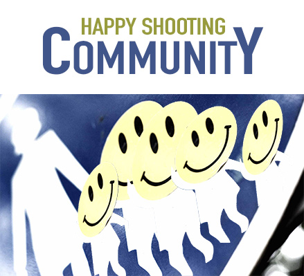
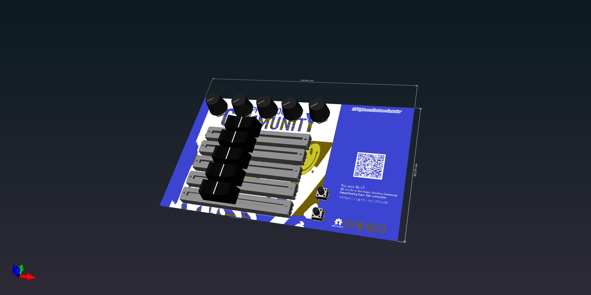
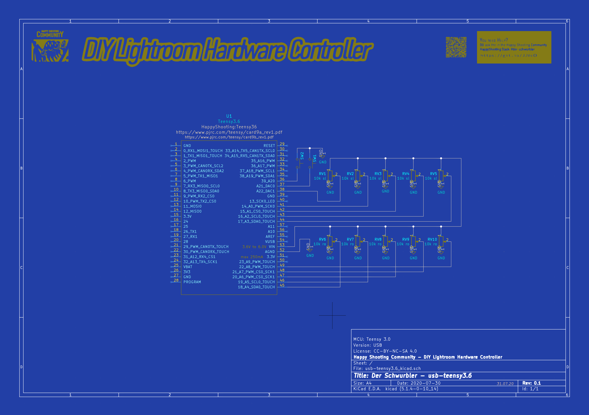

# Der Schwurbler
Happy Shooting Community - DIY Lightroom Hardware Controller

## Description
The german foto podcast legend Happy Shooting had a discussion about Midi controller for Lightroom. One comment on the website and voila a new project is born.
This project will (hopefully) contain everything from zero to hero to get create your own customized Midi Controller for Lightroom.
It is completly community driven, so everyone is allowed to contribute. And it's not intended to earn money with it. Just from the community for the community.
In general you might even need no case, just the pcb with the solded parts. so you will get an extra small extra lightwight device. If that's the thing for you we might even go the capacitive way and reduce the soldered components and weight to a minimum.

## Status of the project
It's just a very first glimpse, and totally work in progress.

## Structure
### Circuit Diagram
 Consists of circuit diagrams. The basic wiring logic.

### Code
 Consists of the source code for the mcu
 * The teensy version used the manufacture's [MIDI Libary](https://www.pjrc.com/teensy/td_libs_MIDI.html)
*To be added soonish*

### Componentlist
 Consists of the list of used components for each version
*To be added soonish*

### Kicad
  Consists of the kicad projects - The mother of the Diagrams, Layouts and renderings.

### PCB
 Consits of Gerber, Etching and Renders
 They can be used to order PCBs from a manufacturer

### Prototyping

Consists of [Fritzing](https://fritzing.org/) files that can be easily recreated on a breadboard.

### Tutorial
 tbd

## Versions
### USB Midi Version
* Based on the Teensy Dev Boards
* USB Powered
* uses a USB midi interface of the hardware

### BLE / Wifi Midi Versions
* Based on a ESP32 Devboard
* 18650 battery powered
* uses Apple MIDI / RTP MIDI or Multicast UDP to send Midi messages over Multicast UDP ( undecided )

### Open questions addressed at the community
What should be created?
* How many patios from which type
* How many buttons
* What size is preferred - Hand soldering, sand or whatever
* Components used - cheaper or better
* MCU - The battery powered Bluetooth wifi version or the bus powered USB-midi version
* Find a better name for this project
Still don't know how you can contribute but want to. Maybe you are the human being who knows best how to deal with e.g. MIDI2LR - Maybe you want to write a tutorial or create a video how to use the Controller with that software.   

## Help needed? F.A.Q.
* For support you can open an issue here on github.
* Maybe there will be a slack contact in the future.
* This project is a Happy Shooting _Community_ Project. 
The best way to get help is joining the #der-schwurbler channel on the happyshooting slack. The community will do it's best and hopefully solve your issue.
* No hotline, no helpdesk. But we have something even greater: The Happy Shooting _Community_.    

## How to contribute
* Fork, add, push, create a pull request
* create an issue on github
* You don't want to use Eagle, Kicad or Fritzing to create a layout. It's totally fine, as long the result can be used to create a PCB with no additional costs to the version created with the other software.

## How can I get one?
* Decide the version, take the Gerber Folder and bom.csv matching your decission. Upload the gerber Files to the manufacturer of your most trust. Mine are some even in china and even there is the delivery time below a week.

## License
* All layouts and diagrams are CC share alike non commercial attribution 4.0 licensed
So you can create and use them on your own even in your company, but you are not allowed to sell them.

 Dieses Werk ist lizenziert unter einer <a rel="license" href="http://creativecommons.org/licenses/by-nc-sa/4.0/">Creative Commons Namensnennung - Nicht-kommerziell - Weitergabe unter gleichen Bedingungen 4.0 International Lizenz</a>.
Namensnennung/Attribution to Happy Shooting Community

## Disclaimer
THE SOFTWARE IS PROVIDED "AS IS", WITHOUT WARRANTY OF ANY KIND, EXPRESS OR IMPLIED, INCLUDING BUT NOT LIMITED TO THE WARRANTIES OF MERCHANTABILITY, FITNESS FOR A PARTICULAR PURPOSE AND NONINFRINGEMENT. IN NO EVENT SHALL THE AUTHORS OR COPYRIGHT HOLDERS BE LIABLE FOR ANY CLAIM, DAMAGES OR OTHER LIABILITY, WHETHER IN AN ACTION OF CONTRACT, TORT OR OTHERWISE, ARISING FROM, OUT OF OR IN CONNECTION WITH THE SOFTWARE OR THE USE OR OTHER DEALINGS IN THE SOFTWARE.
